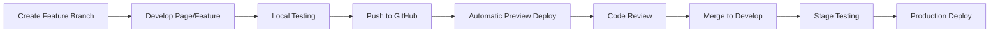

# LoadUp Updated Development Plan

## 1. Current Status & Immediate Focus

### Authentication System Status
- ✅ Sign-in page visually loads (with one error)
- ❌ Sign-up page not loading
- ❌ Full authentication flow not tested
- 🔄 Admin credentials established:
  - Email: zeropointmonkey@gmail.com
  - Password: 69Ford420

### Immediate Tasks
1. **Fix Authentication Pages**
   - Debug and fix sign-up page loading issue
   - Resolve sign-in page error
   - Test complete authentication flow
   - Implement proper error handling
   - Add loading states

## 2. Page-by-Page Development Approach

### Phase 1: Authentication & Core Setup
1. **Authentication Pages**
   - Sign-in page (styling refinement needed)
   - Sign-up page (needs fixing)
   - Password reset page
   - Email verification page
   - Unauthorized access page

2. **Layout & Navigation**
   - Main dashboard layout
   - Responsive sidebar
   - Header with user profile
   - Breadcrumb navigation

### Phase 2: Admin Dashboard Core Pages
1. **Dashboard Overview** (Priority: High)
   - Key metrics display
   - Quick action buttons
   - Recent activity feed
   - Performance charts
   - Real-time alerts

2. **Shipment Management** (Priority: High)
   - Shipment list view
   - Shipment details page
   - Create shipment form
   - Bulk import interface
   - Tracking status page

3. **Driver Management** (Priority: High)
   - Driver list view
   - Driver profile page
   - Assignment dashboard
   - Performance metrics
   - Schedule management

### Phase 3: Advanced Features
1. **Analytics & Reporting**
   - Custom report builder
   - Data visualization dashboard
   - Export functionality
   - Performance insights

2. **Settings & Configuration**
   - Company profile
   - User management
   - System preferences
   - API configuration
   - Notification settings

3. **Support & Documentation**
   - Help center
   - FAQ page
   - Contact support
   - System documentation

## 3. CI/CD Pipeline Implementation

### ✅ Completed Setup
1. **GitHub Actions Workflows**
   - ✅ main.yml: Primary CI/CD pipeline
     - Validation (lint & type checking)
     - Testing
     - Build verification
     - Preview deployments
     - Production deployments
   - ✅ preview.yml: PR preview deployments
     - Automatic preview environments
     - PR comments with deployment URLs

2. **Environment Configuration**
   - ✅ Development environment
   - ✅ Staging environment
   - ✅ Production environment
   - ✅ Environment variables in Vercel

### Next Steps
1. **Testing Enhancement**
   - Add Jest configuration
   - Create test suites for auth flow
   - Add E2E tests with Cypress

2. **Monitoring Setup**
   - Add error tracking
   - Set up performance monitoring
   - Configure alerts

3. **Documentation**
   - Add README updates
   - Document deployment process
   - Create contributing guidelines

## 4. User Experience Considerations

### Admin Dashboard UX
1. **Navigation**
   - Intuitive menu structure
   - Quick access to frequent tasks
   - Breadcrumb navigation
   - Search functionality

2. **Data Presentation**
   - Clean, readable tables
   - Sortable and filterable lists
   - Responsive design
   - Loading states and animations

3. **Interaction Design**
   - Clear call-to-action buttons
   - Consistent form layouts
   - Helpful error messages
   - Success confirmations

### Performance Optimization
1. **Frontend**
   - Code splitting
   - Image optimization
   - Lazy loading
   - Caching strategies

2. **Backend**
   - API response optimization
   - Database query optimization
   - Rate limiting
   - Error handling

## 5. Development Workflow

### 1. Feature Development Process

### 2. Page Development Steps
1. Create page component
2. Implement basic layout
3. Add core functionality
4. Style components
5. Add interactions
6. Implement error handling
7. Add loading states
8. Write tests
9. Optimize performance
10. Document features

## 6. Next Steps

### Immediate Actions (Next 2 Weeks)
1. Fix authentication pages
2. Set up CI/CD pipeline
3. Implement dashboard layout
4. Create dashboard overview page
5. Begin shipment management implementation

### Medium-term Goals (1-2 Months)
1. Complete core admin features
2. Implement analytics
3. Add reporting functionality
4. Optimize performance
5. Begin driver app development

### Long-term Goals (3+ Months)
1. Advanced features implementation
2. Mobile app development
3. Integration with external services
4. Performance optimization
5. Scale testing

## 7. Learning Resources

### NextJS & React
- Next.js Documentation
- React Best Practices
- Tailwind CSS Documentation
- Zustand State Management

### CI/CD & DevOps
- GitHub Actions Documentation
- Vercel Documentation
- Jest Testing Framework
- Docker Basics

### Logistics Domain
- Supply Chain Management
- Logistics Operations
- Fleet Management
- Route Optimization

Remember: This is a living document that will be updated as we progress through development and gather more requirements. 